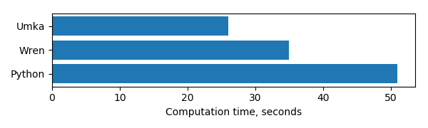
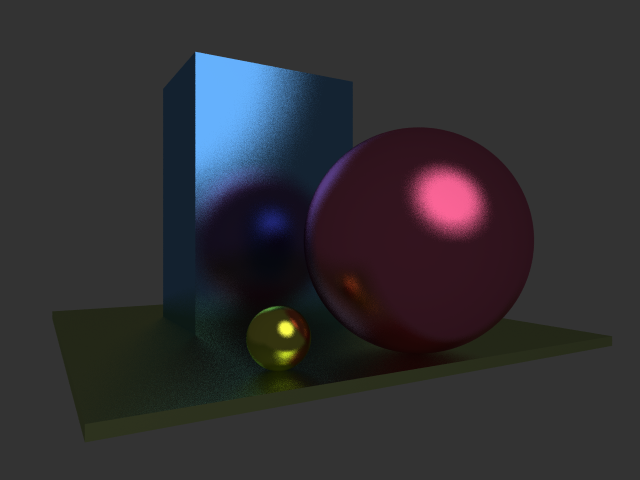
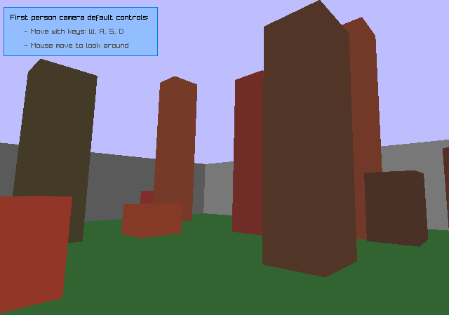
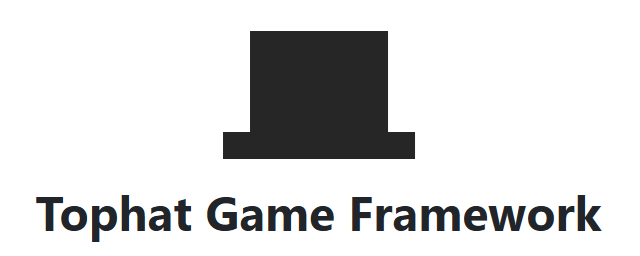
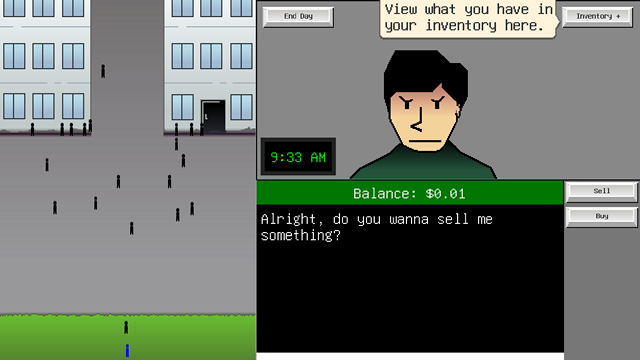
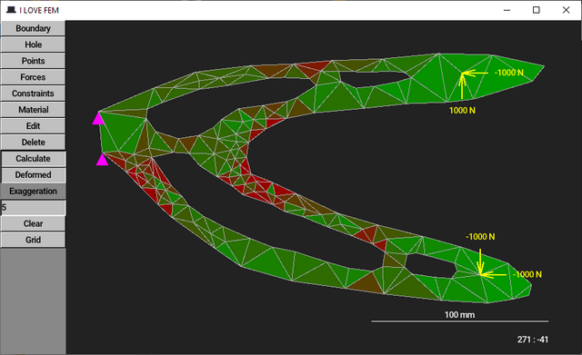
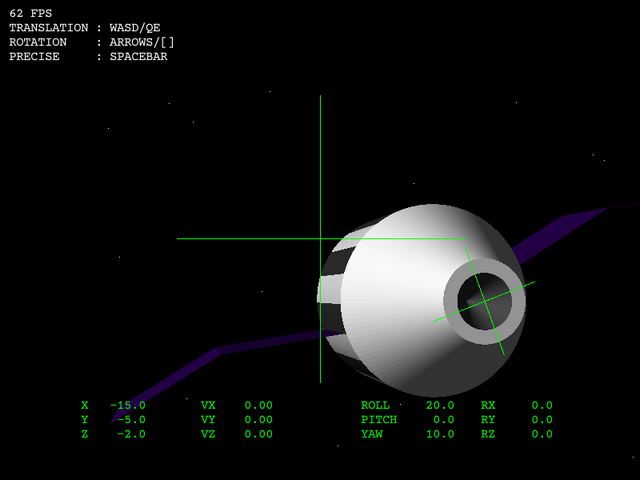
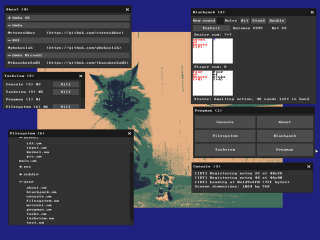

[](https://github.com/vtereshkov/umka-lang/actions)

# Welcome to Umka!
Umka is a statically typed embeddable scripting language. It combines the simplicity and flexibility needed for scripting with a compile-time protection against type errors. Its aim is to follow the Python Zen principle _Explicit is better than implicit_ more consistently than dynamically typed languages generally do.

* [Playground](https://vtereshkov.github.io/umka-lang)
* Downloads
  * [Stable](https://github.com/vtereshkov/umka-lang/releases)
  * [Unstable](https://umbox.tophat2d.dev/api/package/umka/download/box.tar)
* [Packages](https://umbox.tophat2d.dev)
* Documentation
  * [Language](https://github.com/vtereshkov/umka-lang/blob/master/doc/lang.md)
  * [Standard library](https://github.com/vtereshkov/umka-lang/blob/master/doc/lib.md)
  * [Embedding API](https://github.com/vtereshkov/umka-lang/blob/master/doc/api.md)
* [Community](https://discord.gg/PcT7cn59h9)  
* [VS Code plugin](https://marketplace.visualstudio.com/items?itemName=mrms.vscode-umka)

## Features
* Clean syntax inspired by Go
* Cross-platform bytecode compiler and virtual machine
* Garbage collection
* Arrays and structures compatible with C
* Polymorphism via interfaces
* Multitasking based on fibers
* Type inference
* Distribution as a static or dynamic library with a simple C API
* C99 source

## Performance
_400 x 400 matrix multiplication (AMD A4-3300M @ 1.9 GHz, Windows 7)_


## Getting Started
* Try Umka in the [playground](https://vtereshkov.github.io/umka-lang)
* Download the [latest release](https://github.com/vtereshkov/umka-lang/releases) for Windows and Linux
* Take a [tour of Umka](https://github.com/vtereshkov/umka-lang/blob/master/README.md#a-tour-of-umka)
* Read the [language](https://github.com/vtereshkov/umka-lang/blob/master/doc/lang.md) and [standard library](https://github.com/vtereshkov/umka-lang/blob/master/doc/lib.md) documentation
* Join our [community chat](https://discord.gg/PcT7cn59h9) 
* Explore the [raytracer](https://github.com/vtereshkov/umka-lang/blob/master/examples/raytracer/raytracer.um) example that demonstrates many language features like fibers, interfaces and dynamic arrays
* Play with the toy [Lisp interpreter](https://github.com/vtereshkov/umka-lang/blob/master/examples/lisp) written in Umka
* Try the more realistic [C](https://github.com/vtereshkov/umka-lang/blob/master/examples/3dcam/3dcam.c)+[Umka](https://github.com/vtereshkov/umka-lang/blob/master/examples/3dcam/3dcam.um) embedded scripting example (_Note:_ [raylib](https://www.raylib.com) is required to [compile and run it](https://github.com/vtereshkov/umka-lang/blob/master/examples/3dcam/3dcam.md))
* See what [real-life projects](https://github.com/vtereshkov/umka-lang/blob/master/README.md#projects-in-umka) successfully use Umka
* If you are familiar with Go, read about the [differences](https://github.com/vtereshkov/umka-lang/blob/master/README.md#umka-vs-go)

## Examples

* [Raytracer](https://github.com/vtereshkov/umka-lang/blob/master/examples/raytracer/raytracer.um)



* [C](https://github.com/vtereshkov/umka-lang/blob/master/examples/3dcam/3dcam.c)+[Umka](https://github.com/vtereshkov/umka-lang/blob/master/examples/3dcam/3dcam.um) 3D camera



## Projects in Umka

* [tophat](https://tophat2d.dev/): A 2D game framework focused on minimalism
* [SaveScum](https://skejeton.itch.io/savescum): A tophat-based puzzle platformer game 



* [Money, please!](https://skejeton.itch.io/moneyplease): A visual novel/puzzle game. Designed and developed in 96 hours for GMTK Game Jam 2024

 

* [I LOVE FEM](https://github.com/vtereshkov/fem): A tophat-based 2D finite element method demo



* [SpaceSim](https://github.com/vtereshkov/space-sim): A 3D orbital rendez-vous and docking simulation that uses a custom software renderer written in pure Umka, with tophat as a 2D drawing backend



* [Umka OS](https://github.com/skejeton/umka-os): A proof of concept operating system written in C and Umka



* [VDrift/Umka](https://github.com/vtereshkov/vdrift): A racing simulator that lets you design, tune and test your own car autopilot


* TractorSim3D: A 6 DOF tractor dynamics simulator with a scriptable steering controller and [raylib](https://www.raylib.com)-based graphics


## A Tour of Umka
### Hello
```
fn main() {
    printf("Hello Umka!\n")
}
```
### Declarations
#### Constants
```
const a = 3
const b* = 2.38                         // Exported identifier
const (
    c = sin(b) / 5
    d = "Hello" + " World"
)
```
#### Types
```
type IntPtr = ^uint16                   // Pointer
type Arr = [a]real                      // Array
type (
    DynArr = [][5]int                   // Dynamic array
    String = str                        // String
    Button = enum {                     // Enumeration
        left
        middle
        right
    }
    MyMap = map[str]real                // Map
    Quat = struct {                     // Structure
        q: [4]real
        normalized: bool
    }
    Printable = interface {             // Interface
        print(): int
    }
    ErrFn = fn(code: int)               // Function
)
```
#### Variables
```
var e: int
var f: String = d + "!"
var (
    g: Arr = [3]real{2.3, -4.1 / 2, b}
    h: DynArr
    m: MyMap
)
q := Quat{q: [4]real{1, 0, 0, 0}, normalized: true}
```
#### Functions
```
fn tan(x: real): real {return sin(x) / cos(x)}
fn getValue(): (int, bool) {return 42, true}
```
#### Methods
```
fn (a: ^Arr) print(): int {
    printf("Arr: %v\n", a^)
    return 0
}
```
### Statements
#### Assignment
```
h = make([][5]int, 3)   // Dynamic arrays and maps are initialized with make()
m = make(MyMap)
m["Hello Umka"] = 3.14
```
#### Declaration via assignment (with type inference)
```
sum := 0.0
```
#### Function call
```
y := tan(30 * std::pi / 180)
h = append(h, [5]int{10, 20, 30, 40, 50})
h = delete(h, 1)
```
#### Method call
```
g.print()
```
#### Conditional
```
if x, ok := getValue(); ok {
    printf("Got %v\n", x)
}
```
#### Switch
```
switch a {
    case 1, 3, 5, 7: std::println(std::itoa(a) + " is odd")
    case 2, 4, 6, 8: std::println(std::itoa(a) + " is even")
    default:         std::println("I don't know")
}

switch v := type(a) {
    case int: printf("int: %d + 5 = %d\n", v, v + 5)
    case str: printf("str: %s + 5 = %s\n", v, v + "5")
    default:  printf("unknown: %v\n", a)
}
```
#### Loop
```
for k := 1; k <= 128; k *= 2 {
    printf("%v\n", k)
}

for i, x in g {
    if fabs(x) > 1e12 {break}
    if x < 0 {continue}
    sum += x
}
```
### Multitasking
```
a := new(int)
child := make(fiber, |a| {
    for i := 0; i < 5; i++ {
        std::println("Child : i=" + std::itoa(i) + " buf=" + std::itoa(a^))
        a^ = i * 3
        resume()
    }
})
for i := 0; i < 10; i++ {
    std::println("Parent: i=" + std::itoa(i) + " buf=" + std::itoa(a^))
    a^ = i * 7
    if valid(child) {
        resume(child)
    }
} 
```
## Umka vs Go
### Purpose
While Go is a compiled systems programming language with a complex runtime library and big output binaries, Umka is a scripting language with a lightweight interpreter that can be easily embedded into any application as a shared library.

### Syntax
Umka is very similar to Go syntactically. However, in some aspects it's different. It has shorter keywords: `fn` for `func`, `str` for `string`, `in` for `range`. For better readability, it requires a `:` between variable names and types in declarations. It doesn't follow the [unfortunate C tradition](https://blog.golang.org/declaration-syntax) of pointer dereferencing. Instead of `*p`, it uses the Pascal syntax `p^`. As the `*` character is no longer used for pointers, it becomes the export mark, like in Oberon, so that a programmer can freely use upper/lower case letters in identifiers according to his/her own style. Type assertions don't have any special syntax; they look like pointer type casts. Closure definitions require explicit lists of captured variables.

### Semantics
Umka allows implicit type casts and supports default parameters in function declarations. It features the ternary conditional operator deliberately omitted from Go. It doesn't have slices as separate data types. Instead, it supports dynamic arrays, which are declared like Go's slices and initialized by calling `make()`. Method receivers must be pointers. The multithreading model in Umka is inspired by Lua and Wren rather than Go. It offers lightweight threads called fibers instead of goroutines and channels. The garbage collection mechanism is based on reference counting, so Umka needs to support `weak` pointers. Full Unicode support is under development.
