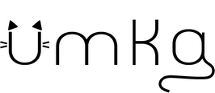
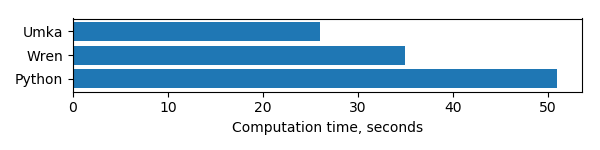
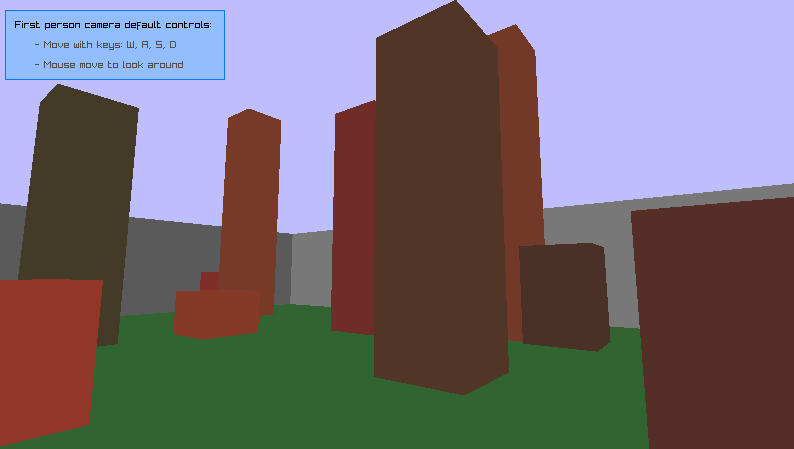

# Welcome to Umka!
Umka is a statically typed embeddable scripting language. It combines the simplicity and flexibility needed for scripting with a compile-time protection against type errors. Its aim is to follow the Python Zen principle _Explicit is better than implicit_ more consistently than dynamically typed languages generally do.

## Features
* Clean syntax inspired by Go
* Cross-platform bytecode compiler and virtual machine
* Garbage collection
* Polymorphism via interfaces
* Multitasking based on fibers
* Type inference
* Distribution as a dynamic library with a simple C API
* C99 source

## Performance
Due to the efficient `for` loop implementation and support for static data structures, Umka demonstrates high performance in multidimensional array operations and similar tasks.

_400 x 400 matrix multiplication (AMD A4-3300M @ 1.9 GHz, Windows 7)_


## Getting Started
* Download the [latest release](https://github.com/vtereshkov/umka-lang/releases) for Windows and Linux
* Take a [tour of Umka](https://github.com/vtereshkov/umka-lang/blob/master/README.md#a-tour-of-umka)
* Explore the [raytracer](https://github.com/vtereshkov/umka-lang/blob/master/examples/raytracer.um) example that demonstrates many language features like fibers, interfaces and dynamic arrays
* Play with the toy [Lisp interpreter](https://github.com/vtereshkov/umka-lang/blob/master/examples/lisp) written in Umka
* Try the more realistic [C](https://github.com/vtereshkov/umka-lang/blob/master/examples/3dcam.c)+[Umka](https://github.com/vtereshkov/umka-lang/blob/master/examples/3dcam.um) embedded scripting example (_Note:_ [raylib](https://www.raylib.com) is required to compile and run it)
* If you are familiar with Go, read about the [differences](https://github.com/vtereshkov/umka-lang/blob/master/README.md#umka-vs-go)
* Look at the [language grammar](https://github.com/vtereshkov/umka-lang/blob/master/README.md#language-grammar) to better understand Umka capabilities

_Raytracer example_


_C+Umka 3D camera example_



## A Tour of Umka
### Hello
```
fn main() {
    printf("Hello Umka!\n")
}
```
### Keywords and operators
_Keywords_
```
break case const continue default else for fn import 
interface if in return str struct switch type var weak
```
_Operators_
```
+    -    *    /    %    &    |    ~    <<    >>
+=   -=   *=   /=   %=   &=   |=   ~=   <<=   >>=
&&   ||   !    ++   --
==   <    >    !=   <=   >=
=    :=   (    )    [    ]    {    }    
^    ;    :    .
```
### Declarations
#### Constants
```
const a = 3
const b* = 2.38                         // Exported identifier
const (
    c = sin(b) / 5
    d = "Hello" + " World"
)
```
_Built-in constants_
```
true false
null
```
#### Types
```
type IntPtr = ^uint16                   // Pointer
type Arr = [a]real                      // Array
type (
    DynArr = [][5]int                   // Dynamic array
    String = str                        // String
    Quat = struct {                     // Structure
        q: [4]real
        normalized: bool
    }
    Printable = interface {             // Interface
        print(): int
    }
    ErrFn = fn(code: int)               // Function
)        
```
_Built-in types_
```
void
int8 int16 int32 int
uint8 uint16 uint32 uint
bool
char
real32 real
fiber
```
#### Variables
```
var e: int
var f: String = d + "!"
var (
    g: Arr = [3]real{2.3, -4.1 / 2, b}
    h: DynArr
)
q := Quat{q: [4]real{1, 0, 0, 0}, normalized: true}
```
#### Functions
```
fn tan(x: real): real {return sin(x) / cos(x)}
fn getValue(): (int, bool) {return 42, true}
```
_Built-in functions_
```
printf fprintf sprintf scanf fscanf sscanf
round trunc fabs sqrt sin cos atan atan2 exp log
new make append delete len sizeof sizeofself selfhasptr
fiberspawn fibercall fiberalive
repr error
```
#### Methods
```
fn (a: ^Arr) print(): int {
    printf("Arr: %s\n", repr(a^))
    return 0
}
```
### Statements
#### Assignment
```
h = make([][5]int, 3)          // Dynamic arrays are initialized with make()
```
#### Declaration via assignment (with type inference)
```
sum := 0.0
```
#### Function call
```
y := tan(30 * std.pi / 180)
h = append(h, [5]int{10, 20, 30, 40, 50})
h = delete(h, 1)
```
#### Method call
```
g.print()
```
#### Conditional
```
if x, ok := getValue(); ok {
    std.println("Got " + repr(x))
}
```
#### Switch
```
switch a {
    case 1, 3, 5, 7: std.println(std.itoa(a) + " is odd")
    case 2, 4, 6, 8: std.println(std.itoa(a) + " is even")
    default:         std.println("I don't know")
}
```
#### Loop
```
    for k := 1; k <= 128; k *= 2 {
        std.println(repr(k))
    }
    
    for i, x in g {
        if fabs(x) > 1e12 {break}
        if x < 0 {continue}
        sum += x
    }
```
### Multitasking
```
fn childFunc(parent: ^fiber, buf: ^int) {
    for i := 0; i < 5; i++ {
        std.println("Child : i=" + std.itoa(i) + " buf=" + std.itoa(buf^))
        buf^ = i * 3
        fibercall(parent)
    }
}

fn parentFunc() {
    a := 0
    child := fiberspawn(childFunc, &a)    
    for i := 0; i < 10; i++ {
        std.println("Parent: i=" + std.itoa(i) + " buf=" + std.itoa(a))
        a = i * 7
        if fiberalive(child) {
            fibercall(child)
        }
    }    
}
```
### Functional tools
```
import "../import/fnc.um"

fn main() {
    var data: fnc.AnyArray = [6]fnc.Any{3, 7, 1, -4, 2, 5}
    printf("Array = %s\n", repr(data))
     
    sqr  := fn (x, ctx: fnc.Any): fnc.Any    {p := ^int(x); return p^ * p^}
    less := fn (x, ctx: fnc.Any): bool       {p := ^int(x); q := ^int(ctx); return p^ < q^} 
    sum  := fn (x, y, ctx: fnc.Any): fnc.Any {p := ^int(x); q := ^int(y); return p^ + q^}     
    
    const max = 30     
    result := data.map(sqr, null).filter(less, max).reduce(sum, null)    
    printf("Sum of all squares less than %d = %s\n", max, repr(result))       
}
```
## Umka vs Go
### Purpose
While Go is a compiled systems programming language with a complex runtime library and big output binaries, Umka is a scripting language with a lightweight interpreter that can be easily embedded into any application as a shared library.

### Syntax
Umka is very similar to Go syntactically. However, in some aspects it's different. It has shorter keywords: `fn` for `func`, `str` for `string`, `in` for `range`. For better readability, it requires a `:` between variable names and type in declarations. It doesn't follow the [unfortunate C tradition](https://blog.golang.org/declaration-syntax) of pointer dereferencing. Instead of `*p`, it uses the Pascal syntax `p^`. As the `*` character is no longer used for pointers, it becomes the export mark, like in Oberon, so that a programmer can freely use upper/lower case letters in identifiers according to his/her own style. Type assertions don't have any special syntax; they look like pointer type casts.

### Semantics
Umka allows implicit type casts and supports default parameters in function declarations. It doesn't have slices. Instead, it supports dynamic arrays, which are declared like Go's slices and initialized by calling `make()`. Method receivers must be pointers. The multithreading model in Umka is inspired by Lua and Wren rather than Go. It offers lightweight threads called fibers instead of goroutines and channels. The garbage collection mechanism is based on reference counting, so Umka needs to support `weak` pointers. Maps, closures and Unicode support are under development.

## Language Grammar
```
program             = module.
module              = [import ";"] decls.
import              = "import" (importItem | "(" {importItem ";"} ")").
importItem          = stringLiteral.
decls               = decl {";" decl}.
decl                = typeDecl | constDecl | varDecl | fnDecl.
typeDecl            = "type" (typeDeclItem | "(" {typeDeclItem ";"} ")").
typeDeclItem        = ident exportMark "=" type.
constDecl           = "const" (constDeclItem | "(" {constDeclItem ";"} ")").
constDeclItem       = ident exportMark "=" expr.
varDecl             = "var" (varDeclItem | "(" {varDeclItem ";"} ")").
varDeclItem         = typedIdentList | ident ":" type "=" exprList.
shortVarDecl        = declAssignmentStmt.
fnDecl              = "fn" [rcvSignature] ident exportMark signature [block].
rcvSignature        = "(" ident ":" type ")".
signature           = "(" [typedIdentList ["=" expr] {"," typedIdentList ["=" expr]}] ")" 
                      [":" (type | "(" type {"," type} ")")].
exportMark          = ["*"].
identList           = ident exportMark {"," ident exportMark}.
typedIdentList      = identList ":" type.
type                = qualIdent | ptrType | arrayType | dynArrayType | strType | structType | fnType.
ptrType             = ["weak"] "^" type.
arrayType           = "[" expr "]" type.
dynArrayType        = "[" "]" type.
strType             = "str".
structType          = "struct" "{" {typedIdentList ";"} "}".
interfaceType       = "interface" "{" {ident signature ";"} "}".
fnType              = "fn" signature.
block               = "{" StmtList "}".
fnBlock             = block.
fnPrototype         = .
stmtList            = Stmt {";" Stmt}.
stmt                = decl | block | simpleStmt | 
                      ifStmt | switchStmt | forStmt | breakStmt | continueStmt | returnStmt.
simpleStmt          = assignmentStmt | shortAssignmentStmt | incDecStmt | callStmt.
singleAssgnStmt     = designator "=" expr.
listAssgnStmt       = designatorList "=" exprList.
assignmentStmt      = singleAssgnStmt | listAssgnStmt.
shortAssignmentStmt = designator ("+=" | "-=" | "*=" | "/=" | "%=" | "&=" | "|=" | "~=") expr.
singleDeclAssgnStmt = ident ":=" expr.
listDeclAssgnStmt   = identList ":=" exprList.
declAssignmentStmt  = singleDeclAssgnStmt | listDeclAssgnStmt.
incDecStmt          = designator ("++" | "--").
callStmt            = designator.
ifStmt              = "if" [shortVarDecl ";"] expr block ["else" (ifStmt | block)].
switchStmt          = "switch" [shortVarDecl ";"] expr "{" {case} [default] "}".
case                = "case" expr {"," expr} ":" stmtList.
default             = "default" ":" stmtList.
forStmt             = "for" (forHeader | forInHeader) block.
forHeader           = [shortVarDecl ";"] expr [";" simpleStmt].
forInHeader         = [ident ","] ident "in" expr.
breakStmt           = "break".
continueStmt        = "continue".
returnStmt          = "return" [exprList].
exprList            = expr {"," expr}.
expr                = logicalTerm {"||" logicalTerm}.
logicalTerm         = relation {"&&" relation}.
relation            = relationTerm [("==" | "!=" | "<" | "<=" | ">" | ">=") relationTerm].
relationTerm        = term {("+" | "-" | "|" | "~") term}.
term                = factor {("*" | "/" | "%" | "<<" | ">>" | "&") factor}.
factor              = designator | intNumber | realNumber | charLiteral | stringLiteral |
                      ("+" | "-" | "!" | "~") factor | "&" designator | "(" expr ")".
designatorList      = designator {"," designator}.
designator          = (primary | typeCast | compositeLiteral) selectors.
primary             = qualIdent | builtinCall.
qualIdent           = [ident "."] ident.
builtinCall         = qualIdent "(" [expr {"," expr}] ")".
selectors           = {derefSelector | indexSelector | fieldSelector | callSelector}.
derefSelector       = "^".
indexSelector       = "[" expr "]".
fieldSelector       = "." ident.
callSelector        = actualParams.
actualParams        = "(" [expr {"," expr}] ")".
compositeLiteral    = arrayLiteral | structLiteral | fnLiteral.
arrayLiteral        = "{" [expr {"," expr}] "}".
structLiteral       = "{" [[ident ":"] expr {"," [ident ":"] expr}] "}".
fnLiteral           = fnBlock.
typeCast            = type "(" expr ")".
ident               = (letter | "_") {letter | "_" | digit}.
intNumber           = decNumber | hexHumber.
decNumber           = digit {digit}.
hexNumber           = "0" "x" hexDigit {hexDigit}.
realNumber          = decNumber ["." decNumber] [("E" | "e") decNumber].
charLiteral         = "'" (char | escSeq) "'".
stringLiteral       = """ {char | escSeq} """.
escSeq              = "\" ("0" | "a" | "b" | "e" | "f" | "n" | "r" | "t" | "v" | "x" hexNumber).
letter              = "A".."Z" | "a".."z".
digit               = "0".."9".
hexDigit            = digit | "A".."F" | "a".."f".
char                = "\x00".."\xFF".
